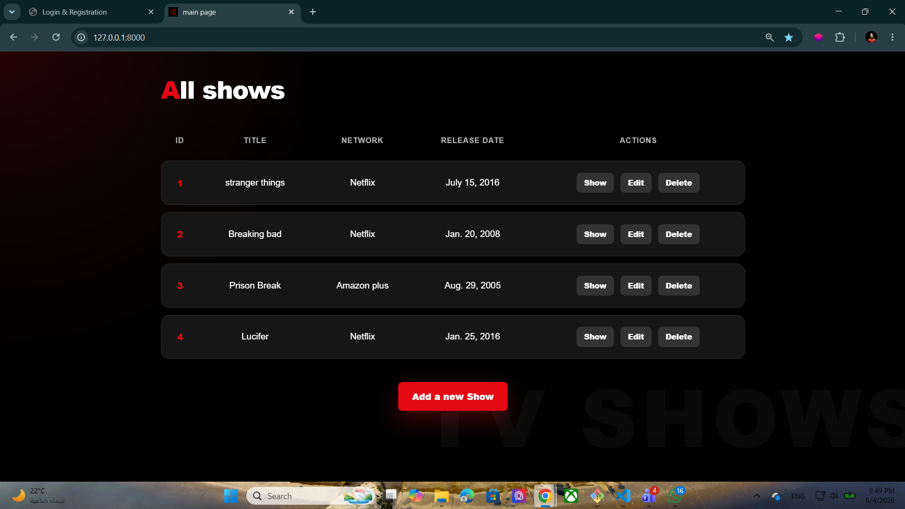
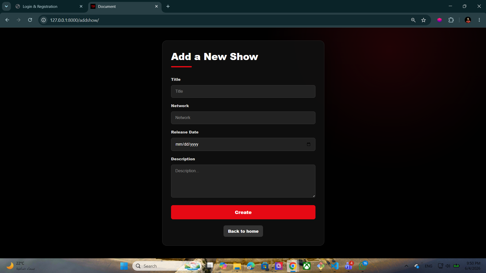
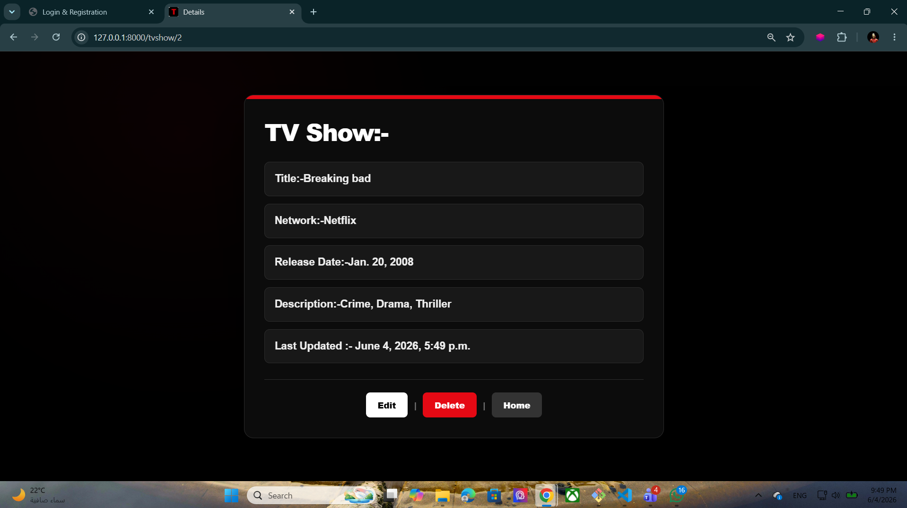
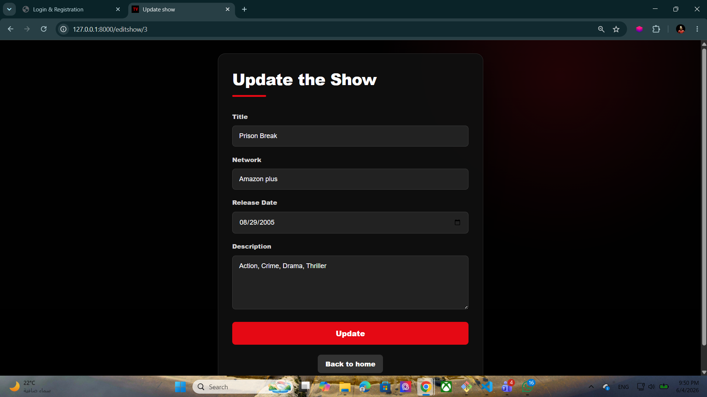

# 📺 SemiRestful TV Shows

A Django web application that allows users to create, view, update, and delete TV shows using full CRUD functionality. This project demonstrates working with Django Models, Views, Templates, Forms, URL Routing, and database operations.

---

## 🚀 Features

- 📋 View all TV shows
- ➕ Add a new TV show
- 👀 View detailed information about a specific show
- ✏️ Edit existing shows
- 🗑️ Delete shows
- 💾 Store data using SQLite and Django ORM
- 🎨 Custom CSS styling for each page

---

## 🛠️ Technologies Used

- Python
- Django
- HTML5
- CSS3
- SQLite3

---

## 📸 Screenshots

### Home Page




### Add Show Page




### Show Details Page




### Edit Show Page




---

## 📖 Database Model

```python
class Show(models.Model):
    title = models.CharField(max_length=50)
    network = models.CharField(max_length=20)
    release_date = models.DateField()
    desc = models.CharField(max_length=255)
    created_at = models.DateTimeField(auto_now_add=True)
    updated_at = models.DateTimeField(auto_now=True)
```

---

## 🔗 Available Routes

| Route | Method | Description |
|---------|---------|-------------|
| `/` | GET | Display all TV shows |
| `/gotoaddshow/` | GET | Display add show form |
| `/addshow/` | POST | Create a new TV show |
| `/tvshow/<id>` | GET | Show TV show details |
| `/editshow/<id>` | GET / POST | Edit existing show |
| `/delete/<id>` | GET | Delete a show |

---

## ⚙️ Installation

```bash
git clone https://github.com/yourusername/SemiRestful-TV-Shows.git
cd SemiRestful-TV-Shows

python -m venv djangoPy3Env
djangoPy3Env\Scripts\activate

pip install django

python manage.py migrate
python manage.py runserver
```

Open:

```text
http://127.0.0.1:8000
```

---

## 🎯 Learning Objectives

- Django Models
- CRUD Operations
- URL Parameters
- Template Rendering
- Forms & POST Requests
- Database Queries
- Static Files (CSS)
- MVT Architecture

---

## 👨‍💻 Author

**Hosni Ahmad**

GitHub: **Hosni2005**
# first-dep
